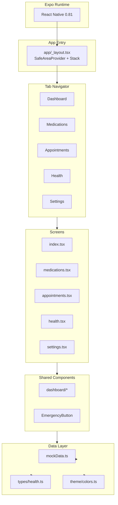

# RTHA — Project Reset Report

**Project:** RTHA (Real-Time Health App)  
**Report Type:** Project Reset / Architecture Baseline  
**Date:** February 2026  
**Platform:** Expo SDK 54 / React Native 0.81  

---

## Table of Contents

1. [Architecture Diagram](#1-architecture-diagram)
2. [Risk & Technical Debt List](#2-risk--technical-debt-list)
3. [Backlog Health Assessment](#3-backlog-health-assessment)

---

## 1. Architecture Diagram

### Current System Architecture (Expo Mobile)

```
┌─────────────────────────────────────────────────────────────────────────────────┐
│                              EXPO RUNTIME                                        │
│                         (React Native 0.81 / Hermes)                             │
└─────────────────────────────────────────────────────────────────────────────────┘
                                        │
                                        ▼
┌─────────────────────────────────────────────────────────────────────────────────┐
│                           APP ENTRY (expo-router)                                │
│                              app/_layout.tsx                                     │
│  ┌─────────────────────────────────────────────────────────────────────────┐    │
│  │  SafeAreaProvider → Stack → (tabs) layout                               │    │
│  └─────────────────────────────────────────────────────────────────────────┘    │
└─────────────────────────────────────────────────────────────────────────────────┘
                                        │
                                        ▼
┌─────────────────────────────────────────────────────────────────────────────────┐
│                         TAB NAVIGATOR (app/(tabs)/)                             │
│  ┌──────────┬──────────┬──────────┬──────────┬──────────┐                       │
│  │Dashboard │Medications│Appointments│ Health  │ Settings │                       │
│  │ (index)  │          │           │         │          │                       │
│  └────┬─────┴────┬─────┴────┬─────┴────┬────┴────┬─────┘                       │
└───────┼──────────┼──────────┼──────────┼─────────┼─────────────────────────────┘
        │          │          │          │         │
        ▼          ▼          ▼          ▼         ▼
┌─────────────────────────────────────────────────────────────────────────────────┐
│                            SCREEN COMPONENTS                                     │
│  ┌─────────────────┐ ┌─────────────────┐ ┌─────────────────┐                   │
│  │ index.tsx       │ │ medications.tsx │ │ appointments.tsx │                   │
│  │ - QuickStats    │ │ - Search        │ │ - Search         │                   │
│  │ - TodayMeds     │ │ - Medication    │ │ - Calendar       │                   │
│  │ - UpcomingApts  │ │   List          │ │ - Appointment    │                   │
│  │ - HealthOverview│ │ - Refill status │ │   List           │                   │
│  │ - EmergencyBtn  │ │                 │ │                 │                   │
│  └────────┬────────┘ └────────┬────────┘ └────────┬────────┘                   │
│           │                  │                   │                              │
│  ┌────────┴────────┐ ┌───────┴───────┐ ┌────────┴────────┐                     │
│  │ health.tsx     │ │ settings.tsx  │ │                 │                     │
│  │ - Metric cards │ │ - Profile     │ │                 │                     │
│  │ - LineChart    │ │ - Contacts    │ │                 │                     │
│  │ - Recent reads │ │ - Notifications│ │                 │                     │
│  └────────┬────────┘ └───────┬───────┘ └─────────────────┘                     │
└───────────┼──────────────────┼─────────────────────────────────────────────────┘
            │                  │
            ▼                  ▼
┌─────────────────────────────────────────────────────────────────────────────────┐
│                      SHARED COMPONENTS (src/components/)                         │
│  ┌─────────────────────────────────┐  ┌─────────────────────────────────────┐ │
│  │ dashboard/                       │  │ emergency/                           │ │
│  │ - QuickStats.tsx                 │  │ - EmergencyButton.tsx                │ │
│  │ - TodayMedications.tsx          │  │   (countdown, modal, mock contacts)   │ │
│  │ - UpcomingAppointments.tsx      │  └─────────────────────────────────────┘ │
│  │ - HealthOverview.tsx            │                                           │
│  └─────────────────────────────────┘                                           │
└─────────────────────────────────────────────────────────────────────────────────┘
                                        │
                                        ▼
┌─────────────────────────────────────────────────────────────────────────────────┐
│                           DATA LAYER (CURRENT)                                   │
│  ┌─────────────────────────────────────────────────────────────────────────┐    │
│  │  src/data/mockData.ts                                                   │    │
│  │  - mockMedications[]     - mockAppointments[]                           │    │
│  │  - mockHealthMetrics[]   - mockEmergencyContacts[]                      │    │
│  │                                                                         │    │
│  │  src/types/health.ts                                                    │    │
│  │  - Medication, Appointment, HealthMetric, EmergencyContact, User        │    │
│  │                                                                         │    │
│  │  src/theme/colors.ts                                                    │    │
│  │  - Design tokens (primary, destructive, success, etc.)                   │    │
│  └─────────────────────────────────────────────────────────────────────────┘    │
│                                                                                 │
│  ⚠️ NO: API layer, auth, persistence, validation, error handling                │
└─────────────────────────────────────────────────────────────────────────────────┘
```

### Mermaid Diagram (for rendering in Markdown/PDF viewers)



### Data Flow (Current)

```
User Action → Screen Component → useState (local) → mockData (direct import)
                    ↓
              No API, No Cache, No Persistence
```

---

## 2. Risk & Technical Debt List

### 2.1 Technical Debt

| # | Item | Category | Severity | Effort |
|---|------|----------|----------|--------|
| TD-1 | Monolithic data layer; no API boundaries; components import mockData directly | Architectural | High | 8–16 hrs |
| TD-2 | Hardcoded user "John"; no authentication or session management | Architectural | Critical | 16–40 hrs |
| TD-3 | Broken test infrastructure (Vitest/Vite); no unit or integration tests | Test | High | 4–8 hrs |
| TD-4 | ~50+ orphaned files from legacy web stack (pages, ui, layout, hooks, configs) | Architectural | Medium | 1–2 hrs |
| TD-5 | Outdated ARCHITECTURE.md describes web stack; no requirements traceability | Documentation | Medium | 1–2 hrs |
| TD-6 | No Error Boundaries; unhandled exceptions crash entire app | Architectural | High | 2–4 hrs |
| TD-7 | Duplicate state across screens (TodayMedications vs MedicationsScreen) | Architectural | High | 4–8 hrs |
| TD-8 | Placeholder buttons (Add Medication, New Appointment, Edit, etc.) do nothing | Architectural | Medium | 8–24 hrs |
| TD-9 | No accessibility attributes (accessibilityLabel, accessibilityRole) | Documentation / UX | Medium | 4–8 hrs |
| TD-10 | ESLint configured for web (browser globals, react-refresh) | Test / Tooling | Low | 1–2 hrs |

### 2.2 Project Risks

| # | Risk | Category | Severity | Mitigation |
|---|------|----------|----------|------------|
| R-1 | AI-generated code without verification; hallucinated logic may ship | Reliability / Hallucination | High | Add tests, defensive checks, CI |
| R-2 | Sensitive health data (PHI) without auth, encryption, or access control | Security & Ethics | Critical | Auth, secure storage, accessibility |
| R-3 | Dependency on Lovable patterns; lucide-react-native + React 19 via legacy-peer-deps | Dependency | Medium | Decouple docs, pin versions, evaluate alternatives |
| R-4 | Emergency Button simulates help but does not call or share location | Security & Ethics | High | Add disclaimer; implement or remove |
| R-5 | No crash reporting or analytics; production issues invisible | Operational | Medium | Integrate Sentry or similar |
| R-6 | No offline support; all data lost on app close | Data | High | Add local DB + sync strategy |

### 2.3 Consolidated Priority Matrix

| Priority | Items | Target |
|----------|-------|--------|
| P0 (Critical) | TD-2, R-2, R-4 | Before any real user data |
| P1 (High) | TD-1, TD-3, TD-6, TD-7, R-1, R-5, R-6 | Before production |
| P2 (Medium) | TD-4, TD-5, TD-8, TD-9, R-3 | Next sprint |
| P3 (Low) | TD-10 | As capacity allows |

---

## 3. Backlog Health Assessment

### 3.1 Backlog Composition

The backlog is derived from:

1. **Technical debt items** (10 items) — remediation work
2. **Risk mitigations** (6 items) — security, reliability, dependency
3. **Planned enhancements** (from ARCHITECTURE.md) — feature work
4. **Placeholder features** — Add/Edit/Delete flows not implemented

### 3.2 Backlog Inventory

| Category | Count | Examples |
|----------|-------|----------|
| Technical Debt | 10 | Data layer, auth, tests, dead code, error boundaries |
| Risk Mitigations | 6 | Auth, secure storage, crash reporting, accessibility |
| Placeholder Features | 6 | Add Medication, New Appointment, Log Reading, Edit Profile, Add Contact, Edit/Delete on lists |
| Planned Enhancements | 6 | Caregiver dashboard, medication interaction checker, wearable sync, PDF reports, i18n |
| **Total** | **28** | (with overlap) |

### 3.3 Health Metrics

| Metric | Score | Assessment |
|--------|-------|------------|
| **Clarity** | 6/10 | Items are documented but not in a single backlog (Jira, Linear, etc.); no story points or acceptance criteria |
| **Prioritization** | 5/10 | P0–P3 exists in this report but not enforced in workflow; no sprint planning |
| **Traceability** | 4/10 | No link from features to user stories or Agile requirements; ARCHITECTURE.md references outdated Lovable Cloud |
| **Completeness** | 7/10 | Major debt and risks captured; some operational items (CI/CD, env config) may be missing |
| **Actionability** | 6/10 | Remediation plans exist but lack subtasks and owners |
| **Velocity** | N/A | No historical velocity; new project post-migration |

### 3.4 Backlog Health Summary

| Dimension | Status | Notes |
|-----------|--------|-------|
| **Size** | ⚠️ Large | 28+ items; recommend splitting into phases |
| **Debt Ratio** | 🔴 High | ~60% debt/mitigation vs. feature work |
| **Blockers** | 🔴 Yes | Auth and data layer block most feature work |
| **Definition of Done** | 🔴 Missing | No DoD for stories; no test requirements |
| **Sprint Readiness** | 🟡 Partial | P0/P1 items can be broken down; P2/P3 need refinement |

### 3.5 Recommended Backlog Structure

```
Phase 1: Foundation (2–3 weeks)
├── TD-4: Remove dead code
├── TD-5: Update ARCHITECTURE.md
├── TD-6: Add Error Boundaries
├── TD-10: Fix ESLint for React Native
└── TD-3: Set up Jest + React Native Testing Library

Phase 2: Data & Auth (3–4 weeks)
├── TD-1: Introduce data abstraction layer
├── TD-7: Shared state (Context/Zustand)
├── TD-2: Authentication service
└── R-2: Secure storage for tokens

Phase 3: Feature Completion (2–3 weeks)
├── TD-8: Implement Add/Edit/Delete flows
├── R-4: Emergency Button disclaimer or implementation
└── R-1: Add tests for critical paths

Phase 4: Production Readiness (2+ weeks)
├── R-5: Crash reporting
├── R-6: Offline support (local DB)
├── TD-9: Accessibility audit
└── R-3: Dependency documentation
```

### 3.6 Backlog Health Score

**Overall Backlog Health: 5.5 / 10 — Needs Improvement**

- **Strengths:** Risks and debt are identified; remediation plans exist; architecture is documented in this report.
- **Gaps:** No formal backlog tool; no story points or velocity; high debt ratio; blockers (auth, data) must be addressed before feature velocity can improve.

**Recommendation:** Adopt a lightweight backlog (e.g., GitHub Projects, Linear) with the phase structure above. Define acceptance criteria and "Definition of Done" (e.g., "all P1 items require at least one test") before starting Phase 1.

---

## Appendix: File Structure (Current)

```
app/
├── _layout.tsx              # Root layout
└── (tabs)/
    ├── _layout.tsx          # Tab navigator
    ├── index.tsx            # Dashboard
    ├── medications.tsx
    ├── appointments.tsx
    ├── health.tsx
    └── settings.tsx

src/
├── components/
│   ├── dashboard/           # QuickStats, TodayMedications, UpcomingAppointments, HealthOverview
│   └── emergency/           # EmergencyButton
├── data/
│   └── mockData.ts
├── theme/
│   └── colors.ts
└── types/
    └── health.ts
```

---

*This report serves as the Project Reset baseline. Re-assess after Phase 1 completion.*
